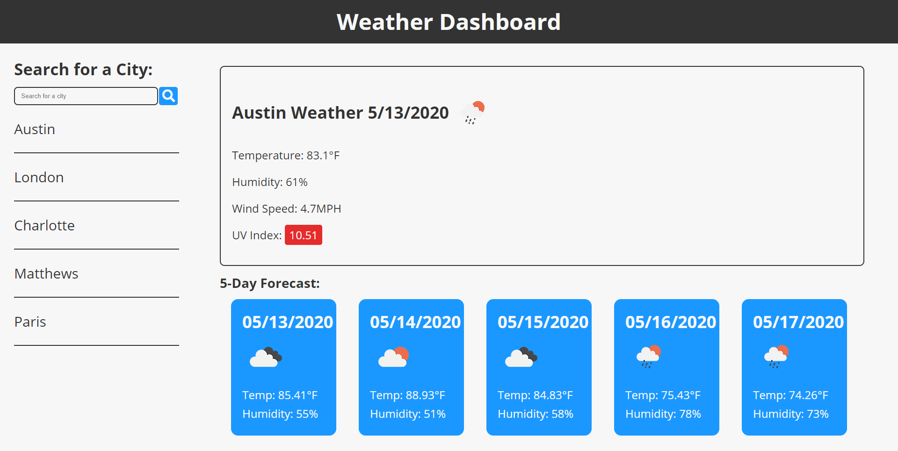

# Weather Dashboard

# Deployed Application

https://ryand67.github.io/Weather-Dashboard/

# About

This weather dashboard takes input from the user with a city name, then with the help of the OpenWeatherMap API gets the current and future forecast for the inputted city. The search history is then displayed on the left hand side, and you can click on the entries to search for that city's weather again.

# Screenshot

